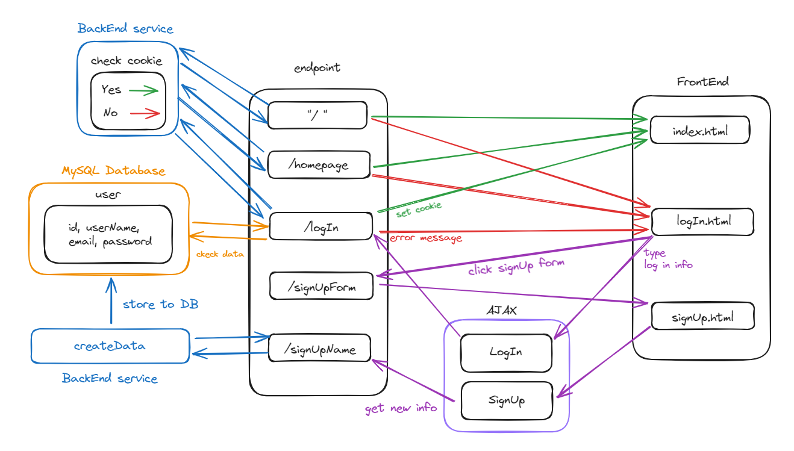

Here is a flow diagram for the assignment.

When the server is started, you can access it using two ways for access:
- `/`
- `/homepage`

Because you haven't logged in yet, the webpage will automatically redirect to the logIn.html.

#### If you have an account

You can log in using your email and password.
If email and password are correct, a cookie will be set using the username.
If there is an error, you will receive an error message.

#### If you don't have any account

You can click "Sign Up For Free" to create an account.
After entering the UserName, email, and password, clicking the "Sign Up For Free" button, it will send the data to the database and redirect back to the logIn.html.

